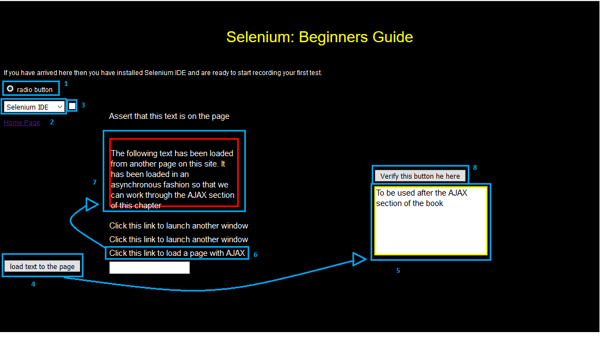

# Projeto Automação Testes Selenium

Projeto com a ferramenta Selenium de uma página simples.

- Este projeto utiliza os padrões Singleton e Page Object.

Os testes automatizados são realizados no site [http://book.theautomatedtester.co.uk/chapter1](http://book.theautomatedtester.co.uk/chapter1), que já é um site destinado para testes com a ferramenta Selenium.

A ordem dos testes automatizados é realizada de acordo com a imagem abaixo:

### Recursos utilizados:

- Selenium Java
- Selenium Chrome Driver [Download Aqui](https://sites.google.com/a/chromium.org/chromedriver/downloads)
- Junit
- Maven

### Como configurar o ambiente:

- Faça clone do projeto;
- Importe o projeto para sua IDE de preferência.

